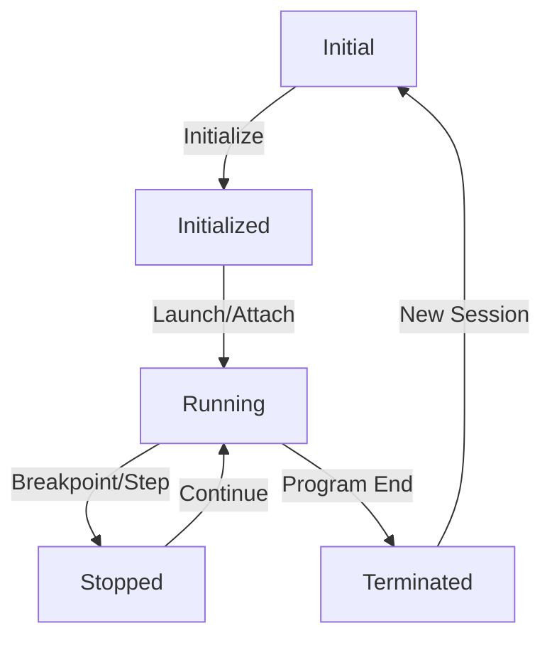

# Debugging Guide

## Starting a Debug Session

### Initialization
1. The debug session starts with the `initialize` command, which sets up the debug adapter with client capabilities.
2. The debug adapter responds with its capabilities, including supported features and options.

### Launching a Program
1. Use the `launch` command to start debugging a program:
   ```json
   {
     "command": "launch",
     "arguments": {
       "program": "path/to/program",
       "stopOnEntry": true,
       "noDebug": false
     }
   }
   ```
2. Key launch options:
   - `stopOnEntry`: If true, execution stops at the program entry point
   - `noDebug`: If true, runs without debugging
   - `args`: Command line arguments for the program

### Attaching to a Process
1. Use the `attach` command to connect to a running process:
   ```json
   {
     "command": "attach",
     "arguments": {
       "processId": 1234
     }
   }
   ```

## Thread Management

### Thread States
Threads can be in one of these states:
- `running`: Thread is executing
- `stopped`: Thread is paused (e.g., at a breakpoint)
- `terminated`: Thread has finished execution

### Thread Commands
1. List threads:
   ```json
   {
     "command": "threads"
   }
   ```
   Response includes thread IDs, names, and states.

2. Pause threads:
   ```json
   {
     "command": "pause",
     "arguments": {
       "threadId": 0  // 0 for all threads, specific ID for single thread
     }
   }
   ```

3. Continue threads:
   ```json
   {
     "command": "continue",
     "arguments": {
       "threadId": 0  // 0 for all threads, specific ID for single thread
     }
   }
   ```

## Stepping Commands

### Step Types
1. Step Over (`next`):
   - Executes the current line and stops at the next line
   - Skips over function calls
   ```json
   {
     "command": "next",
     "arguments": {
       "threadId": 1
     }
   }
   ```

2. Step Into (`stepIn`):
   - Executes the current line and stops at the first line of any called function
   ```json
   {
     "command": "stepIn",
     "arguments": {
       "threadId": 1
     }
   }
   ```

3. Step Out (`stepOut`):
   - Executes until the current function returns
   ```json
   {
     "command": "stepOut",
     "arguments": {
       "threadId": 1
     }
   }
   ```

### Stopped Events
When execution stops, the debug adapter sends a `stopped` event:
```json
{
  "event": "stopped",
  "body": {
    "reason": "step",
    "threadId": 1,
    "allThreadsStopped": true,
    "description": "Stepped over instruction"
  }
}
```

Common stop reasons:
- `step`: Stopped after a step command
- `breakpoint`: Hit a breakpoint
- `exception`: Hit an exception
- `pause`: Stopped due to pause command
- `entry`: Stopped at program entry

## Disassembly

### Viewing Disassembly
1. Request disassembly for a memory range:
   ```json
   {
     "command": "disassemble",
     "arguments": {
       "memoryReference": "0x1000",
       "offset": 0,
       "instructionOffset": 0,
       "instructionCount": 10
     }
   }
   ```

2. Response includes:
   - Instructions with addresses
   - Symbol information
   - Source line mapping

## Memory Access

### Reading Memory
1. Read memory at a specific address:
   ```json
   {
     "command": "readMemory",
     "arguments": {
       "memoryReference": "0x1000",
       "offset": 0,
       "count": 64
     }
   }
   ```

2. Response includes:
   ```json
   {
     "address": "0x1000",
     "data": "base64-encoded-bytes",
     "unreadableBytes": 0
   }
   ```

### Writing Memory
1. Write to memory:
   ```json
   {
     "command": "writeMemory",
     "arguments": {
       "memoryReference": "0x1000",
       "offset": 0,
       "data": "base64-encoded-bytes",
       "allowPartial": false
     }
   }
   ```

2. Response includes:
   ```json
   {
     "bytesWritten": 64,
     "offset": 0
   }
   ```

### Memory Access Best Practices
1. Always verify memory permissions before access
2. Use appropriate alignment for memory operations
3. Handle partial reads/writes carefully
4. Consider endianness when interpreting data
5. Use memory breakpoints for monitoring memory access

## Register Access

### Reading Registers
1. List available registers:
   ```json
   {
     "command": "readRegisters",
     "arguments": {
       "registers": ["r0", "r1", "pc", "sp"]
     }
   }
   ```

2. Response includes:
   ```json
   {
     "registers": [
       {
         "name": "r0",
         "value": "0x1234",
         "type": "integer"
       },
       {
         "name": "pc",
         "value": "0x1000",
         "type": "integer"
       }
     ]
   }
   ```

### Writing Registers
1. Write to registers:
   ```json
   {
     "command": "writeRegisters",
     "arguments": {
       "registers": [
         {
           "name": "r0",
           "value": "0x5678"
         },
         {
           "name": "pc",
           "value": "0x2000"
         }
       ]
     }
   }
   ```

### Register Access Best Practices
1. Verify register availability before access
2. Handle register size differences
3. Consider register access permissions
4. Be cautious when modifying control registers
5. Save register state before modifications

## Breakpoints

### Line Breakpoints
1. Set breakpoints at specific lines:
   ```json
   {
     "command": "setBreakpoints",
     "arguments": {
       "source": {
         "path": "path/to/source.c"
       },
       "breakpoints": [
         {
           "line": 42,
           "column": 1,
           "condition": "x > 10",
           "hitCondition": "5"
         }
       ]
     }
   }
   ```

2. Breakpoint options:
   - `condition`: Expression that must evaluate to true
   - `hitCondition`: Number of hits before stopping
   - `logMessage`: Message to log instead of stopping

### Function Breakpoints
1. Set breakpoints at function entry:
   ```json
   {
     "command": "setFunctionBreakpoints",
     "arguments": {
       "breakpoints": [
         {
           "name": "main",
           "condition": "argc > 1"
         }
       ]
     }
   }
   ```

### Exception Breakpoints
1. Set breakpoints for exceptions:
   ```json
   {
     "command": "setExceptionBreakpoints",
     "arguments": {
       "filters": [
         "uncaught",
         "all"
       ]
     }
   }
   ```

### Data Breakpoints
1. Set breakpoints on memory access:
   ```json
   {
     "command": "setDataBreakpoints",
     "arguments": {
       "breakpoints": [
         {
           "dataId": "0x1000",
           "accessType": "write",
           "condition": "value == 0xdeadbeef"
         }
       ]
     }
   }
   ```

### Breakpoint Types
1. Hardware Breakpoints:
   - Limited in number
   - Fast execution
   - Can break on read/write/execute

2. Software Breakpoints:
   - Unlimited in number
   - Slower execution
   - Can only break on execute

3. Conditional Breakpoints:
   - Break when condition is true
   - Can include expressions
   - Can have hit counts

### Breakpoint Best Practices
1. Use appropriate breakpoint type:
   - Hardware for performance-critical code
   - Software for unlimited breakpoints
   - Conditional for complex conditions

2. Breakpoint Management:
   - Clear unused breakpoints
   - Use meaningful conditions
   - Consider breakpoint impact on performance

3. Advanced Features:
   - Use hit conditions for repetitive code
   - Combine with logging for tracing
   - Use data breakpoints for memory monitoring

## Best Practices

### Thread Management
1. Always check thread states before stepping
2. Use thread ID 0 for operations affecting all threads
3. Handle thread-specific breakpoints carefully
4. Consider thread synchronization when debugging

### Stepping
1. Use appropriate step type for the situation:
   - `next` for quick line-by-line execution
   - `stepIn` to debug function calls
   - `stepOut` to quickly return from functions
2. Monitor the `stopped` event for step completion
3. Check thread states after stepping

### Disassembly
1. Use disassembly to:
   - Debug optimized code
   - Verify instruction execution
   - Understand program flow
2. Combine with source view for better context
3. Use memory references carefully

## Common Issues and Solutions

### Thread Issues
1. Thread not stopping:
   - Verify thread ID is correct
   - Check if thread is in a valid state
   - Ensure thread is not blocked

2. Multiple threads:
   - Use thread ID 0 for global operations
   - Handle thread-specific breakpoints
   - Consider thread synchronization

### Stepping Issues
1. Step not working:
   - Verify thread is in stopped state
   - Check for breakpoints
   - Ensure source mapping is correct

2. Unexpected stops:
   - Check for breakpoints
   - Verify exception handling
   - Review thread states

### Disassembly Issues
1. Invalid memory reference:
   - Verify address is valid
   - Check memory permissions
   - Ensure proper alignment

2. Missing symbols:
   - Check debug information
   - Verify symbol loading
   - Review source mapping

## Number Formats

### Supported Formats
1. Decimal (base 10):
   - Format: Plain numbers without prefix
   - Examples: `42`, `-123`, `0`
   - Usage: Default format for most numeric values
   - Limitations: Cannot start with 0 (except for 0 itself)

2. Hexadecimal (base 16):
   - Format: `0x` or `0X` prefix
   - Examples: `0x1A`, `0XFF`, `0xdeadbeef`
   - Usage: Memory addresses, register values, bit patterns
   - Case sensitivity: Letters can be uppercase or lowercase
   - Valid digits: 0-9, a-f, A-F

3. Octal (base 8):
   - Format: `0` prefix
   - Examples: `077`, `0123`
   - Usage: File permissions, legacy systems
   - Valid digits: 0-7
   - Note: Leading zero alone (e.g., `0`) is treated as decimal

### Format Usage Guidelines

#### Memory Addresses
1. Always use hexadecimal:
   ```json
   {
     "command": "readMemory",
     "arguments": {
       "memoryReference": "0x1000"  // Correct
       // "memoryReference": "4096"  // Avoid decimal
       // "memoryReference": "02000" // Avoid octal
     }
   }
   ```

2. Register Values:
   ```json
   {
     "command": "writeRegisters",
     "arguments": {
       "registers": [
         {
           "name": "r0",
           "value": "0x1234"  // Preferred for register values
         }
       ]
     }
   }
   ```

#### Breakpoint Conditions
1. Mixed formats in expressions:
   ```json
   {
     "command": "setBreakpoints",
     "arguments": {
       "breakpoints": [
         {
           "line": 42,  // Decimal for line numbers
           "condition": "x == 0x10 || y == 16"  // Mixing hex and decimal
         }
       ]
     }
   }
   ```

2. Hit conditions:
   ```json
   {
     "command": "setBreakpoints",
     "arguments": {
       "breakpoints": [
         {
           "hitCondition": "0x0A"  // Hex for bit patterns
         }
       ]
     }
   }
   ```

### Format Conversion Rules
1. String to Number:
   - Leading `0x` or `0X` → Hexadecimal
   - Leading `0` (except alone) → Octal
   - Otherwise → Decimal

2. Number to String:
   - Memory addresses → Always hexadecimal with `0x` prefix
   - Line numbers → Always decimal
   - Register values → Usually hexadecimal
   - Bit patterns → Usually hexadecimal

### Common Pitfalls
1. Octal Confusion:
   ```json
   // Incorrect - interpreted as octal
   {
     "memoryReference": "0123"  // Actually 83 in decimal
   }
   
   // Correct
   {
     "memoryReference": "0x7B"  // 123 in hexadecimal
   }
   ```

2. Leading Zeros:
   ```json
   // Incorrect - interpreted as octal
   {
     "value": "012"  // Actually 10 in decimal
   }
   
   // Correct
   {
     "value": "12"   // 12 in decimal
   }
   ```

3. Negative Numbers:
   ```json
   // Incorrect
   {
     "value": "-0x10"  // Invalid format
   }
   
   // Correct
   {
     "value": "-16"    // Use decimal for negative numbers
   }
   ```

### Best Practices
1. Memory Operations:
   - Always use hexadecimal with `0x` prefix
   - Use uppercase letters for consistency
   - Pad with leading zeros for alignment

2. Register Operations:
   - Use hexadecimal for bit patterns
   - Use decimal for simple counts
   - Be consistent with format choice

3. Breakpoint Conditions:
   - Use decimal for line numbers
   - Use hexadecimal for memory addresses
   - Use appropriate format for the context

4. General Guidelines:
   - Be explicit with prefixes
   - Avoid leading zeros unless octal is intended
   - Use consistent formatting within each context
   - Document format expectations in comments

## Starting the Debug Client

### Command Line Options
1. Basic startup:
   ```bash
   dap_debugger -h hostname -p port program_file [options]
   ```

2. Common options:
   - `-h hostname`: Server hostname (default: localhost)
   - `-p port`: Server port number (default: 4711)
   - `-e`: Stop at program entry point
   - `-s source_path`: Path to source code
   - `-m map_file`: Path to memory map file

### Initialization Sequence
1. Connect to server:
   ```json
   {
     "command": "initialize",
     "arguments": {
       "clientID": "nd100x-debugger",
       "clientName": "ND100X Debugger",
       "adapterID": "nd100x",
       "pathFormat": "path",
       "linesStartAt1": true,
       "columnsStartAt1": true,
       "supportsVariableType": true,
       "supportsVariablePaging": true,
       "supportsRunInTerminalRequest": false,
       "supportsMemoryReferences": true
     }
   }
   ```

2. Launch program:
   ```json
   {
     "command": "launch",
     "arguments": {
       "program": "path/to/program.bin",
       "stopOnEntry": true,
       "noDebug": false,
       "sourceMap": "path/to/map_file.map",
       "sourcePaths": ["path/to/source"]
     }
   }
   ```

### Loading Binary Files
1. Supported formats:
   - Raw binary (`.bin`)
   - Intel HEX (`.hex`)
   - Motorola S-record (`.srec`)

2. Binary loading options:
   ```json
   {
     "command": "launch",
     "arguments": {
       "program": "program.bin",
       "loadAddress": "0x1000",
       "entryPoint": "0x1000",
       "memorySize": "0x10000"
     }
   }
   ```

### Source Code Management

#### Loading Source Files
1. Specify source paths:
   ```json
   {
     "command": "launch",
     "arguments": {
       "sourcePaths": [
         "src/main",
         "src/lib",
         "include"
       ]
     }
   }
   ```

2. Load specific source:
   ```json
   {
     "command": "source",
     "arguments": {
       "source": {
         "path": "src/main.c"
       }
     }
   }
   ```

#### Source Mapping
1. Using map files:
   ```json
   {
     "command": "launch",
     "arguments": {
       "sourceMap": "program.map",
       "sourceMapFormat": "nd100x"  // Custom format
     }
   }
   ```

2. Map file format:
   ```text
   # ND100X Memory Map
   # Format: address line file
   0x1000 42 src/main.c
   0x1004 43 src/main.c
   0x1008 44 src/main.c
   ```

### Memory-Source Mapping

#### Address to Line Mapping
1. Get source location for address:
   ```json
   {
     "command": "source",
     "arguments": {
       "sourceReference": "0x1000"
     }
   }
   ```

2. Response includes:
   ```json
   {
     "source": {
       "name": "main.c",
       "path": "src/main.c",
       "line": 42,
       "column": 1
     }
   }
   ```

#### Line to Address Mapping
1. Get address for source line:
   ```json
   {
     "command": "disassemble",
     "arguments": {
       "source": {
         "path": "src/main.c",
         "line": 42
       }
     }
   }
   ```

2. Response includes:
   ```json
   {
     "instructions": [
       {
         "address": "0x1000",
         "instruction": "mov r0, #1",
         "line": 42
       }
     ]
   }
   ```

### Best Practices

#### Binary Loading
1. Always specify load address
2. Verify memory range is available
3. Check entry point validity
4. Consider memory alignment

#### Source Management
1. Keep source paths organized
2. Use consistent naming conventions
3. Maintain up-to-date map files
4. Document source structure

#### Mapping Management
1. Generate map files during build
2. Verify map file accuracy
3. Handle multiple source files
4. Consider optimization effects

### Common Issues

#### Binary Loading
1. Invalid load address:
   - Check memory map
   - Verify address range
   - Consider alignment

2. Missing entry point:
   - Verify symbol table
   - Check map file
   - Validate binary format

#### Source Management
1. Missing source files:
   - Check source paths
   - Verify file permissions
   - Update map files

2. Incorrect line mapping:
   - Regenerate map files
   - Check optimization settings
   - Verify source versions

## Debugger State Management

### Server States
1. Initial State:
   - Server is created but not initialized
   - No client connection
   - No program loaded
   - No breakpoints set

2. Initialized State:
   - Client connected
   - Capabilities exchanged
   - Ready for launch/attach
   - No program running

3. Running State:
   - Program loaded
   - Execution in progress
   - Breakpoints active
   - Threads may be running/stopped

4. Stopped State:
   - Program paused
   - Threads stopped
   - Breakpoints active
   - Ready for inspection

5. Terminated State:
   - Program execution ended
   - Resources cleaned up
   - Ready for new session

### State Transitions


### State-Specific Operations
1. Initialized State:
   ```json
   {
     "command": "launch",
     "arguments": {
       "program": "program.bin"
     }
   }
   ```

2. Running State:
   ```json
   {
     "command": "pause",
     "arguments": {
       "threadId": 0
     }
   }
   ```

3. Stopped State:
   ```json
   {
     "command": "stackTrace",
     "arguments": {
       "threadId": 1
     }
   }
   ```

## Advanced Breakpoints

### Conditional Breakpoints

#### Expression-Based Conditions
1. Simple comparison:
   ```json
   {
     "command": "setBreakpoints",
     "arguments": {
       "breakpoints": [
         {
           "line": 42,
           "condition": "x > 10"
         }
       ]
     }
   }
   ```

2. Complex expressions:
   ```json
   {
     "command": "setBreakpoints",
     "arguments": {
       "breakpoints": [
         {
           "line": 42,
           "condition": "(x > 10) && (y < 20) || (z == 0)"
         }
       ]
     }
   }
   ```

3. Function calls:
   ```json
   {
     "command": "setBreakpoints",
     "arguments": {
       "breakpoints": [
         {
           "line": 42,
           "condition": "isValid(x) && checkStatus(y)"
         }
       ]
     }
   }
   ```

#### Hit Count Conditions
1. Exact count:
   ```json
   {
     "command": "setBreakpoints",
     "arguments": {
       "breakpoints": [
         {
           "line": 42,
           "hitCondition": "5"
         }
       ]
     }
   }
   ```

2. Modulo count:
   ```json
   {
     "command": "setBreakpoints",
     "arguments": {
       "breakpoints": [
         {
           "line": 42,
           "hitCondition": "%10"
         }
       ]
     }
   }
   ```

3. Greater than:
   ```json
   {
     "command": "setBreakpoints",
     "arguments": {
       "breakpoints": [
         {
           "line": 42,
           "hitCondition": ">100"
         }
       ]
     }
   }
   ```

### Hardware Breakpoints

#### Memory Access Breakpoints
1. Read access:
   ```json
   {
     "command": "setDataBreakpoints",
     "arguments": {
       "breakpoints": [
         {
           "dataId": "0x1000",
           "accessType": "read",
           "condition": "value == 0x1234"
         }
       ]
     }
   }
   ```

2. Write access:
   ```json
   {
     "command": "setDataBreakpoints",
     "arguments": {
       "breakpoints": [
         {
           "dataId": "0x1000",
           "accessType": "write",
           "condition": "value == 0xdeadbeef"
         }
       ]
     }
   }
   ```

3. Read/Write access:
   ```json
   {
     "command": "setDataBreakpoints",
     "arguments": {
       "breakpoints": [
         {
           "dataId": "0x1000",
           "accessType": "readWrite",
           "condition": "value & 0x80000000"
         }
       ]
     }
   }
   ```

#### CPU Event Breakpoints
1. Interrupt entry:
   ```json
   {
     "command": "setExceptionBreakpoints",
     "arguments": {
       "filters": [
         {
           "filter": "interrupt",
           "condition": "irq == 1"
         }
       ]
     }
   }
   ```

2. Privilege level change:
   ```json
   {
     "command": "setExceptionBreakpoints",
     "arguments": {
       "filters": [
         {
           "filter": "privilege",
           "condition": "level == 0"
         }
       ]
     }
   }
   ```

3. CPU mode change:
   ```json
   {
     "command": "setExceptionBreakpoints",
     "arguments": {
       "filters": [
         {
           "filter": "mode",
           "condition": "mode == 'supervisor'"
         }
       ]
     }
   }
   ```

### Breakpoint Types and Limitations

#### Hardware Breakpoints
1. Memory access:
   - Limited number (typically 4-8)
   - Can break on read/write/execute
   - Can specify address ranges
   - Can combine with conditions

2. CPU events:
   - Interrupt entry/exit
   - Privilege level changes
   - Mode switches
   - Exception entry/exit

#### Software Breakpoints
1. Instruction breakpoints:
   - Unlimited number
   - Only break on execute
   - Can use conditions
   - Can use hit counts

2. Function breakpoints:
   - Break on function entry
   - Can use conditions
   - Can use hit counts
   - Support wildcards

### Breakpoint Best Practices

#### Hardware Breakpoints
1. Use for performance-critical code
2. Reserve for memory monitoring
3. Consider address alignment
4. Check CPU support

#### Software Breakpoints
1. Use for general debugging
2. Combine with conditions
3. Use hit counts for loops
4. Clear when not needed

#### CPU Event Breakpoints
1. Use for system debugging
2. Monitor privilege changes
3. Track interrupt handling
4. Debug mode switches

## Best Practices

### Thread Management
1. Always check thread states before stepping
2. Use thread ID 0 for operations affecting all threads
3. Handle thread-specific breakpoints carefully
4. Consider thread synchronization when debugging

### Stepping
1. Use appropriate step type for the situation:
   - `next` for quick line-by-line execution
   - `stepIn` to debug function calls
   - `stepOut` to quickly return from functions
2. Monitor the `stopped` event for step completion
3. Check thread states after stepping

### Disassembly
1. Use disassembly to:
   - Debug optimized code
   - Verify instruction execution
   - Understand program flow
2. Combine with source view for better context
3. Use memory references carefully

## Common Issues and Solutions

### Thread Issues
1. Thread not stopping:
   - Verify thread ID is correct
   - Check if thread is in a valid state
   - Ensure thread is not blocked

2. Multiple threads:
   - Use thread ID 0 for global operations
   - Handle thread-specific breakpoints
   - Consider thread synchronization

### Stepping Issues
1. Step not working:
   - Verify thread is in stopped state
   - Check for breakpoints
   - Ensure source mapping is correct

2. Unexpected stops:
   - Check for breakpoints
   - Verify exception handling
   - Review thread states

### Disassembly Issues
1. Invalid memory reference:
   - Verify address is valid
   - Check memory permissions
   - Ensure proper alignment

2. Missing symbols:
   - Check debug information
   - Verify symbol loading
   - Review source mapping

## Number Formats

### Supported Formats
1. Decimal (base 10):
   - Format: Plain numbers without prefix
   - Examples: `42`, `-123`, `0`
   - Usage: Default format for most numeric values
   - Limitations: Cannot start with 0 (except for 0 itself)

2. Hexadecimal (base 16):
   - Format: `0x` or `0X` prefix
   - Examples: `0x1A`, `0XFF`, `0xdeadbeef`
   - Usage: Memory addresses, register values, bit patterns
   - Case sensitivity: Letters can be uppercase or lowercase
   - Valid digits: 0-9, a-f, A-F

3. Octal (base 8):
   - Format: `0` prefix
   - Examples: `077`, `0123`
   - Usage: File permissions, legacy systems
   - Valid digits: 0-7
   - Note: Leading zero alone (e.g., `0`) is treated as decimal

### Format Usage Guidelines

#### Memory Addresses
1. Always use hexadecimal:
   ```json
   {
     "command": "readMemory",
     "arguments": {
       "memoryReference": "0x1000"  // Correct
       // "memoryReference": "4096"  // Avoid decimal
       // "memoryReference": "02000" // Avoid octal
     }
   }
   ```

2. Register Values:
   ```json
   {
     "command": "writeRegisters",
     "arguments": {
       "registers": [
         {
           "name": "r0",
           "value": "0x1234"  // Preferred for register values
         }
       ]
     }
   }
   ```

#### Breakpoint Conditions
1. Mixed formats in expressions:
   ```json
   {
     "command": "setBreakpoints",
     "arguments": {
       "breakpoints": [
         {
           "line": 42,  // Decimal for line numbers
           "condition": "x == 0x10 || y == 16"  // Mixing hex and decimal
         }
       ]
     }
   }
   ```

2. Hit conditions:
   ```json
   {
     "command": "setBreakpoints",
     "arguments": {
       "breakpoints": [
         {
           "hitCondition": "0x0A"  // Hex for bit patterns
         }
       ]
     }
   }
   ```

### Format Conversion Rules
1. String to Number:
   - Leading `0x` or `0X` → Hexadecimal
   - Leading `0` (except alone) → Octal
   - Otherwise → Decimal

2. Number to String:
   - Memory addresses → Always hexadecimal with `0x` prefix
   - Line numbers → Always decimal
   - Register values → Usually hexadecimal
   - Bit patterns → Usually hexadecimal

### Common Pitfalls
1. Octal Confusion:
   ```json
   // Incorrect - interpreted as octal
   {
     "memoryReference": "0123"  // Actually 83 in decimal
   }
   
   // Correct
   {
     "memoryReference": "0x7B"  // 123 in hexadecimal
   }
   ```

2. Leading Zeros:
   ```json
   // Incorrect - interpreted as octal
   {
     "value": "012"  // Actually 10 in decimal
   }
   
   // Correct
   {
     "value": "12"   // 12 in decimal
   }
   ```

3. Negative Numbers:
   ```json
   // Incorrect
   {
     "value": "-0x10"  // Invalid format
   }
   
   // Correct
   {
     "value": "-16"    // Use decimal for negative numbers
   }
   ```

### Best Practices
1. Memory Operations:
   - Always use hexadecimal with `0x` prefix
   - Use uppercase letters for consistency
   - Pad with leading zeros for alignment

2. Register Operations:
   - Use hexadecimal for bit patterns
   - Use decimal for simple counts
   - Be consistent with format choice

3. Breakpoint Conditions:
   - Use decimal for line numbers
   - Use hexadecimal for memory addresses
   - Use appropriate format for the context

4. General Guidelines:
   - Be explicit with prefixes
   - Avoid leading zeros unless octal is intended
   - Use consistent formatting within each context
   - Document format expectations in comments

## Starting the Debug Client

### Command Line Options
1. Basic startup:
   ```bash
   dap_debugger -h hostname -p port program_file [options]
   ```

2. Common options:
   - `-h hostname`: Server hostname (default: localhost)
   - `-p port`: Server port number (default: 4711)
   - `-e`: Stop at program entry point
   - `-s source_path`: Path to source code
   - `-m map_file`: Path to memory map file

### Initialization Sequence
1. Connect to server:
   ```json
   {
     "command": "initialize",
     "arguments": {
       "clientID": "nd100x-debugger",
       "clientName": "ND100X Debugger",
       "adapterID": "nd100x",
       "pathFormat": "path",
       "linesStartAt1": true,
       "columnsStartAt1": true,
       "supportsVariableType": true,
       "supportsVariablePaging": true,
       "supportsRunInTerminalRequest": false,
       "supportsMemoryReferences": true
     }
   }
   ```

2. Launch program:
   ```json
   {
     "command": "launch",
     "arguments": {
       "program": "path/to/program.bin",
       "stopOnEntry": true,
       "noDebug": false,
       "sourceMap": "path/to/map_file.map",
       "sourcePaths": ["path/to/source"]
     }
   }
   ```

### Loading Binary Files
1. Supported formats:
   - Raw binary (`.bin`)
   - Intel HEX (`.hex`)
   - Motorola S-record (`.srec`)

2. Binary loading options:
   ```json
   {
     "command": "launch",
     "arguments": {
       "program": "program.bin",
       "loadAddress": "0x1000",
       "entryPoint": "0x1000",
       "memorySize": "0x10000"
     }
   }
   ```

### Source Code Management

#### Loading Source Files
1. Specify source paths:
   ```json
   {
     "command": "launch",
     "arguments": {
       "sourcePaths": [
         "src/main",
         "src/lib",
         "include"
       ]
     }
   }
   ```

2. Load specific source:
   ```json
   {
     "command": "source",
     "arguments": {
       "source": {
         "path": "src/main.c"
       }
     }
   }
   ```

#### Source Mapping
1. Using map files:
   ```json
   {
     "command": "launch",
     "arguments": {
       "sourceMap": "program.map",
       "sourceMapFormat": "nd100x"  // Custom format
     }
   }
   ```

2. Map file format:
   ```text
   # ND100X Memory Map
   # Format: address line file
   0x1000 42 src/main.c
   0x1004 43 src/main.c
   0x1008 44 src/main.c
   ```

### Memory-Source Mapping

#### Address to Line Mapping
1. Get source location for address:
   ```json
   {
     "command": "source",
     "arguments": {
       "sourceReference": "0x1000"
     }
   }
   ```

2. Response includes:
   ```json
   {
     "source": {
       "name": "main.c",
       "path": "src/main.c",
       "line": 42,
       "column": 1
     }
   }
   ```

#### Line to Address Mapping
1. Get address for source line:
   ```json
   {
     "command": "disassemble",
     "arguments": {
       "source": {
         "path": "src/main.c",
         "line": 42
       }
     }
   }
   ```

2. Response includes:
   ```json
   {
     "instructions": [
       {
         "address": "0x1000",
         "instruction": "mov r0, #1",
         "line": 42
       }
     ]
   }
   ```

### Best Practices

#### Binary Loading
1. Always specify load address
2. Verify memory range is available
3. Check entry point validity
4. Consider memory alignment

#### Source Management
1. Keep source paths organized
2. Use consistent naming conventions
3. Maintain up-to-date map files
4. Document source structure

#### Mapping Management
1. Generate map files during build
2. Verify map file accuracy
3. Handle multiple source files
4. Consider optimization effects

### Common Issues

#### Binary Loading
1. Invalid load address:
   - Check memory map
   - Verify address range
   - Consider alignment

2. Missing entry point:
   - Verify symbol table
   - Check map file
   - Validate binary format

#### Source Management
1. Missing source files:
   - Check source paths
   - Verify file permissions
   - Update map files

2. Incorrect line mapping:
   - Regenerate map files
   - Check optimization settings
   - Verify source versions

## MMU and Address Spaces

### Virtual vs Physical Addresses
1. Breakpoint Address Types:
   ```json
   {
     "command": "setBreakpoints",
     "arguments": {
       "breakpoints": [
         {
           "line": 42,
           "addressSpace": "virtual",  // or "physical"
           "address": "0x1000"
         }
       ]
     }
   }
   ```

2. Memory Access Breakpoints:
   ```json
   {
     "command": "setDataBreakpoints",
     "arguments": {
       "breakpoints": [
         {
           "dataId": "0x1000",
           "addressSpace": "virtual",
           "accessType": "readWrite"
         }
       ]
     }
   }
   ```

### Address Space Management
1. Virtual Address Breakpoints:
   - Break on virtual address access
   - Automatically track page translations
   - Update on context switches
   - Handle page faults

2. Physical Address Breakpoints:
   - Break on physical memory access
   - Bypass MMU translation
   - Fixed location in memory
   - Useful for DMA debugging

## Data Loading and Path Handling

### Source Code Loading
1. Server-side Loading:
   ```json
   {
     "command": "launch",
     "arguments": {
       "sourceLoadMode": "server",  // or "client"
       "sourcePaths": [
         "/absolute/path/to/source",
         "relative/path/from/workspace"
       ]
     }
   }
   ```

2. Client-side Loading:
   ```json
   {
     "command": "source",
     "arguments": {
       "source": {
         "path": "src/main.c",
         "content": "base64-encoded-source"
       }
     }
   }
   ```

### Path Resolution
1. Absolute Paths:
   ```json
   {
     "source": {
       "path": "/home/user/project/src/main.c",
       "pathFormat": "absolute"
     }
   }
   ```

2. Relative Paths:
   ```json
   {
     "source": {
       "path": "src/main.c",
       "workspaceFolder": "/home/user/project",
       "pathFormat": "relative"
     }
   }
   ```

## Memory-Source Mapping Implementation

### Mapping Storage
1. Server-side Mapping:
   ```json
   {
     "event": "mappingUpdate",
     "body": {
       "type": "sourceMap",
       "mappings": [
         {
           "address": "0x1000",
           "line": 42,
           "file": "src/main.c",
           "column": 1
         }
       ]
     }
   }
   ```

2. Client-side Cache:
   ```json
   {
     "command": "source",
     "arguments": {
       "sourceReference": "0x1000",
       "useCache": true
     }
   }
   ```

### Disassembly Process
1. Request Disassembly:
   ```json
   {
     "command": "disassemble",
     "arguments": {
       "memoryReference": "0x1000",
       "instructionOffset": 0,
       "instructionCount": 10,
       "resolveSymbols": true
     }
   }
   ```

2. Response with Mapping:
   ```json
   {
     "instructions": [
       {
         "address": "0x1000",
         "instruction": "mov r0, #1",
         "line": 42,
         "source": {
           "name": "main.c",
           "path": "src/main.c"
         }
       }
     ]
   }
   ```

## Event Flow and Synchronization

### Breakpoint Flow Example
1. Set Breakpoint:
   ```json
   // Client -> Server
   {
     "command": "setBreakpoints",
     "arguments": {
       "source": {
         "path": "src/main.c"
       },
       "breakpoints": [
         {
           "line": 42
         }
       ]
     }
   }

   // Server -> Client
   {
     "event": "breakpoint",
     "body": {
       "reason": "changed",
       "breakpoint": {
         "id": 1,
         "verified": true,
         "line": 42
       }
     }
   }
   ```

2. Run to Breakpoint:
   ```json
   // Client -> Server
   {
     "command": "continue",
     "arguments": {
       "threadId": 1
     }
   }

   // Server -> Client (when breakpoint hits)
   {
     "event": "stopped",
     "body": {
       "reason": "breakpoint",
       "threadId": 1,
       "allThreadsStopped": true,
       "hitBreakpointIds": [1]
     }
   }
   ```

3. Update Views:
   ```json
   // Client -> Server (request current state)
   {
     "command": "threads"
   }
   {
     "command": "stackTrace",
     "arguments": {
       "threadId": 1
     }
   }
   {
     "command": "scopes",
     "arguments": {
       "frameId": 0
     }
   }

   // Server -> Client (register updates)
   {
     "event": "registerUpdate",
     "body": {
       "threadId": 1,
       "registers": [
         {
           "name": "r0",
           "value": "0x1234"
         }
       ]
     }
   }
   ```

### Register Updates
1. Event-based Updates:
   ```json
   {
     "event": "registerUpdate",
     "body": {
       "threadId": 1,
       "registers": [
         {
           "name": "pc",
           "value": "0x1000"
         }
       ]
     }
   }
   ```

2. Poll-based Updates:
   ```json
   // Client -> Server
   {
     "command": "readRegisters",
     "arguments": {
       "threadId": 1,
       "registers": ["r0", "r1", "pc"]
     }
   }
   ```

### Memory Updates
1. Event-based Updates:
   ```json
   {
     "event": "memoryUpdate",
     "body": {
       "address": "0x1000",
       "data": "base64-encoded-data"
     }
   }
   ```

2. Poll-based Updates:
   ```json
   // Client -> Server
   {
     "command": "readMemory",
     "arguments": {
       "memoryReference": "0x1000",
       "count": 64
     }
   }
   ```

### View Synchronization
1. Source View Updates:
   ```json
   // Server -> Client
   {
     "event": "sourceUpdate",
     "body": {
       "source": {
         "name": "main.c",
         "path": "src/main.c"
       },
       "line": 42,
       "column": 1
     }
   }
   ```

2. State Synchronization:
   ```json
   // Server -> Client
   {
     "event": "stateUpdate",
     "body": {
       "threadId": 1,
       "state": "stopped",
       "reason": "breakpoint",
       "source": {
         "name": "main.c",
         "path": "src/main.c",
         "line": 42
       }
     }
   }
   ``` 